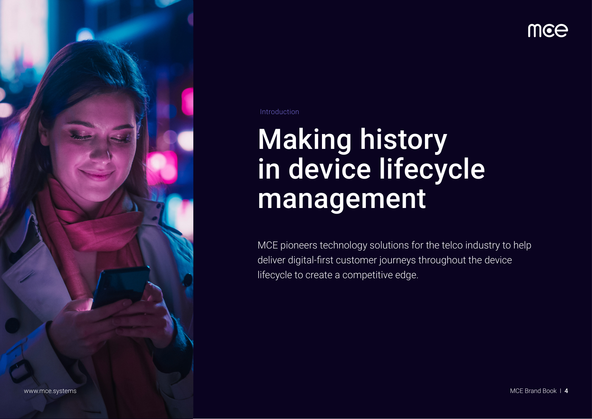

# MCE Branding

## Visual Style

We're keeping the visual soul, but pivoting the context.

Based on analysis of reference images in `/context/` folder.

### Primary Aesthetic: Retro Pixel Art / 8-bit Gaming

**Style characteristics:**
- **Pixel art rendering** with visible pixel blocks creating nostalgic gaming feel
- **Cinematic composition** — each image tells a story or captures a mood
- **Atmospheric lighting** with dramatic contrasts

### Official MCE Brand Colors

From the MCE Brand Book (section 03 — Brand Colours). Use these for accurate, on-brand reproduction.

**Primary colours**

| Name        | HEX       | RGB            | CMYK              | Pantone |
|------------|-----------|----------------|-------------------|---------|
| Black      | `#1B1C1E` | 27, 28, 30     | 30, 30, 10, 100   | —       |
| Dark Purple| `#0B0321` | 11, 3, 33      | —                 | —       |
| Magenta | `#f025b0` | | | |
| Light Blue | `#342FB0` | 52, 47, 176    | 100, 90, 0, 2     | 2736C   |
| Pure White | `#FFFFFF` | 255, 255, 255  | 0, 0, 0, 0        | —       |

**Secondary colours**

| Name       | HEX       | RGB            | CMYK            | Pantone |
|------------|-----------|----------------|-----------------|---------|
| Purple     | `#746DD4` | 116, 109, 212  | 73, 68, 0, 0    | 2725C   |
| Yellow     | `#FFBF00` | 255, 191, 0    | 0, 22, 83, 0    | 136C    |
| Dark Blue  | `#00009F` | 0, 0, 159      | 100, 91, 0, 10  | 2746C   |
| Light Grey | `#F6F7F9` | 246, 247, 249  | 14, 8, 4, 0     | 427C    |

**Logo colour rules (from brand book)**  
- Primary logo colour: **Dark Purple** (`#0B0321`).  
- Logo may also be **white** on dark/coloured backgrounds, or black/white when colour is not available.  
- Do not use colours outside the approved palette.

**Colour treatment — 60/30/10 rule**  
- **60%** primary colour (e.g. Dark Purple, Black)  
- **30%** secondary (e.g. White, Light Grey)  
- **10%** accent (e.g. Yellow, Light Blue, Purple)

**Brand gradients** (use no more than two colours per gradient; follow 60/30/10)

| Gradient          | Colour 1   | Colour 2   |
|-------------------|------------|------------|
| Blue              | `#0B0321`  | `#342FB0`  |
| Dark Purple       | `#0B0321`  | `#746DD4`  |
| Light Purple      | `#746DD4`  | `#342FB0`  |
| Yellow            | `#FFBF00`  | `#FFD810`  |
| Grey              | `#D0D4D8`  | `#F6F7F9`  |
| Black              | `#1B1C1E`  | `#000000`  |

**Asset reference:** `./assets/MCE Branding official color palette.afpalette`  
**Source:** MCE Brand Book (PDF) — pages 11–14 (Brand Colours, Colour Treatment, Gradient Colours, Gradient Rules).

**Example — palette in an image** (from the brand book; purple/blue lighting and dark background):

---

### Hackathon visual direction (colour mood)

For this event we keep the visual soul but pivot the context. Suggested mood (aligned with reference images in `/context/`):

**Warm & vibrant with neon accents**
- **Primary:** Deep oranges, warm yellows, vibrant reds, bright purples (use MCE palette where possible: Yellow `#FFBF00`, Purple `#746DD4`, Light Blue `#342FB0`)