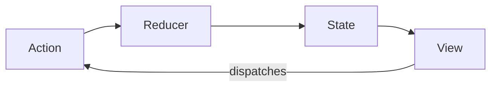

# The Elements of the Architecture

These 16 principles guide every decision we make. They're not rules to memorize—they're a way of thinking about code.


---

## State & Data

### Application Scope

Every feature belongs to a specific scope. We define boundaries clearly so that code doesn't leak across concerns.

### Immutable State

We never mutate state directly. Instead, we create new versions of state. This makes changes predictable and debugging straightforward.

### Global State Only

There is one source of truth: the global store. We avoid local component state for application data. This eliminates synchronization bugs and makes the application state inspectable.

---

## Code Style

### Declarative Code

We describe *what* we want, not *how* to get it. Declarative code is easier to read and reason about than imperative step-by-step instructions.

```typescript
// Declarative: what we want
const activeUsers = users.filter(user => user.isActive);

// Imperative: how to get it (avoid this)
const activeUsers = [];
for (let i = 0; i < users.length; i++) {
  if (users[i].isActive) {
    activeUsers.push(users[i]);
  }
}
```

### Written For Humans

Code is read far more often than it's written. We optimize for readability. Variable names are clear. Functions are short. Logic is obvious.

### Short Files

Files should be around 100 lines. If a file grows beyond that, it's a signal to split it into smaller, focused modules.

---

## Structure

### Uniform Structures

Similar things look similar. Every component folder has the same structure. Every store branch follows the same pattern. Consistency reduces cognitive load.

### Fixed File Structure

Every project uses the same folder layout. When you've seen one Ripe project, you can navigate any Ripe project.

### Loose Coupling

Modules depend on abstractions, not implementations. We can change the internals of a module without affecting others.

---

## Data Flow

### Unidirectional Information Flow

Data flows in one direction: from actions, through reducers, to state, to the view. Never backwards. Never sideways.



### Reactive View

The view layer reacts to state changes. Components don't fetch data or manage business logic—they simply reflect what's in the store.

### Event Driven

User interactions and system events trigger actions. Actions describe what happened, not what should happen next.

---

## Logic & Composition

### Isolated Business Logic

Business logic lives in one place: the listener layer. It's not scattered across components or mixed into reducers.

### Composition Over Configuration

We build complex features by combining simple pieces, not by configuring monolithic components. Small, focused modules compose into powerful systems.

### Quick Start Ready

New developers can clone and run a project immediately. Dependencies are explicit. Setup is automated.

---

## Vocabulary

### Application Vocabulary

Actions form the vocabulary of your application. Reading the action names tells you what the application can do:

- `showMenu`
- `fetchItemsSuccess`
- `setUserLanguage`
- `addToCart`

This vocabulary makes the codebase self-documenting.

---

## Summary

These elements aren't independent rules—they reinforce each other:

- **Immutable state** enables **reactive views**
- **Fixed file structure** supports **uniform structures**
- **Declarative code** makes things **written for humans**
- **Loose coupling** allows **composition over configuration**

When you're unsure about a design decision, return to these principles. They'll guide you to the right answer.

---

**Next:** [Global State Composition](/client-architecture/02-global-state)
