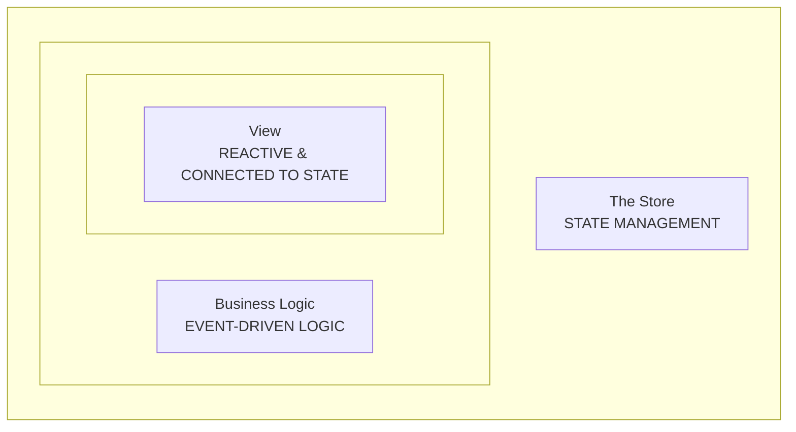
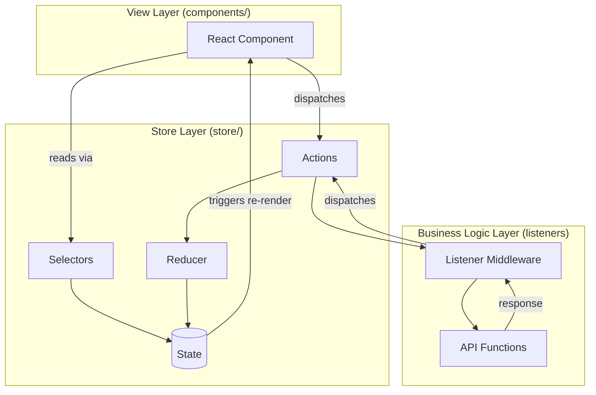

# Functional Layers

> **Commandment IV:** Three Distinct Layers of Concerns

---

## The Core Idea

We divide all code into **three distinct layers**:




Each layer has a specific responsibility:

| Layer | Responsibility | Location |
|-------|---------------|----------|
| **Store** | State management | `store/` |
| **Business Logic** | Side effects, API calls, complex decisions | `store/*/listeners.ts` |
| **View** | Rendering UI | `components/` |

All layers should be kept **as simple as possible** by pushing logic into the appropriate layer.

---

## Layer 1: The Store

The innermost layer. The core. This is where state lives.

### What It Does

- Defines the state structure
- Declares possible actions
- Maps actions to state mutations (reducers)
- Provides selectors for state access (caching)

### Characteristics

- **Branch-by-branch composition** — Each feature has its own slice
- **Simple & declarative actions** — Actions describe intent
- **Zero-logic reducers** — Just assignment and removal
- **Immutable state** — Never mutate directly
- **Grouping by state branch** — All files for a branch live together
- **Strongly defined conventions** — Same structure everywhere
- **External API drivers per branch** — API functions live with their branch

### Files in the Store Layer

```
store/cart/
├── types.ts              # State interface, payload types
├── cart.actions.ts       # Action creators
├── cart.reducer.ts       # Default state + reducer
├── cart.selectors.ts     # Memoized selectors
└── cart.listeners.ts     # Business logic (see Layer 2)
```

---

## Layer 2: Business Logic

This is where the "thinking" happens. Listeners respond to actions and orchestrate side effects.

### What It Does

- Responds to actions
- Performs async operations (API calls)
- Makes decisions based on current state
- Dispatches follow-up actions

### Characteristics

- **View agnostic** — Doesn't know about components
- **Deliberately isolated** — Logic is contained, not scattered
- **Declarative, event-driven pattern** — Reacts to actions
- **Little to no complex dependency injection** — Simple, flat dependencies
- **Only Redux actions trigger logic** — No direct function calls from views

### Where Logic Lives

```
store/
├── app/
│   ├── api/
│   │   └── fetchAppConfig.ts    # API functions
│   └── app.listeners.ts         # Business logic
├── store.ts
└── listener.ts                  # Listener middleware setup
```

---

## How Listeners Work


We use Redux Toolkit's **Listener Middleware**. It lets you listen to any action and run async/side-effect code when that action happens.

> **Full example:** See [listeners/examples/reducer](../examples/listeners/examples/reducer)

### Basic Pattern

```typescript
import { createListenerMiddleware, isAnyOf } from '@reduxjs/toolkit';

const listenerMiddleware = createListenerMiddleware();

// 1. Most common pattern: listen to a specific action
listenerMiddleware.startListening({
  actionCreator: userLoggedIn,
  effect: async (action, listenerApi) => {
    // You get full access to dispatch + getState
    listenerApi.dispatch(showWelcomeToast());
    
    // You can do async work
    const user = await api.getUserProfile(action.payload.userId);
    listenerApi.dispatch(userProfileLoaded(user));
  },
});
```

### Multiple Actions

```typescript
// 2. Listen to several actions at once
listenerMiddleware.startListening({
  matcher: isAnyOf(userLoggedIn, userLoggedOut, tokenExpired),
  effect: async (_, { dispatch }) => {
    dispatch(refreshSidebar());
    dispatch(checkNotifications());
  },
});
```

### Listening by Predicate

```typescript
// 3. Listen by action type pattern (useful for 3rd party actions)
listenerMiddleware.startListening({
  predicate: (action) => action.type.endsWith('/rejected'),
  effect: async (action) => {
    const error = action.payload as ApiError;
    // Handle all rejected actions
  },
});
```

### Canceling Previous Effects

```typescript
// 4. Cancel previous running effects (great for search)
listenerMiddleware.startListening({
  actionCreator: searchQueryChanged,
  effect: async (action, { cancelActiveListeners, dispatch }) => {
    // Cancel any previous search that's still running
    cancelActiveListeners();
    
    // This will automatically cancel if a new search comes in
    const results = await api.search(action.payload);
    dispatch(searchResultsLoaded(results));
  },
});
```

---

## Listener Examples in Practice


Here's a real-world listener file:

```typescript
// store/cart/cart.listeners.ts
export const listeners: Listener[] = [
  {
    actionCreator: setLocation,
    effect: async (action, { dispatch, getState }) => {
      const { pathname } = action.payload;
      
      // If navigating to shop page, start polling
      if (matchPath("/shop/:shopId", pathname)) {
        setTimeout(() => {
          if (getState().service.pollingEnabled) {
            dispatch(enablePolling());
          }
        }, RETRY_DELAY);
        return;
      }
      
      dispatch(disablePolling());
    },
  },
  {
    actionCreator: setActiveShop,
    effect: async (action, { dispatch, getOriginalState }) => {
      const shopId = action.payload.id;
      
      // Don't refetch if already on this shop
      if (shopId === getOriginalState().shop.id) {
        return;
      }
      
      // Check route
      const currentLocation = getState().router.location;
      if (currentLocation) {
        const historyRouteMatch = matchPath("/shop/:shopId/history", currentLocation.pathname);
        if (historyRouteMatch) {
          return;
        }
      }
      
      // Fetch the shop's queue
      dispatch(getServiceQueue());
    },
  },
  {
    actionCreator: getServiceQueue,
    effect: async (action, { dispatch, getState }) => {
      const shopId = getState().shop.id;
      
      if (!shopId) {
        dispatch(getServiceQueueFailure({ error: "No shop id found" }));
        return;
      }
      
      try {
        const requests = await fetchServiceRequests(shopId);
        
        // Check if polling is still enabled
        const { pollingEnabled, queue } = getState().service;
        
        dispatch(getServiceQueueSuccess({ ...requests }));
      } catch (e) {
        dispatch(getServiceQueueFailure({ error: "Failed to fetch requests" }));
      }
    },
  },
  {
    actionCreator: statusSkip,
    effect: async (action, { dispatch, getState }) => {
      const shopId = getState().shop.id;
      
      if (!shopId) {
        dispatch(getServiceQueueFailure({ error: "No shop id found" }));
        return;
      }
      
      const { reason, comment } = getState().ui.skipCustomer;
      const reasonText = `${reason}\n----\n${comment}`;
      
      try {
        await updateServiceRequestStatus(shopId, action.payload.id, EntityStatus.Skipped, reasonText);
        dispatch(resetSkipCustomer());
      } catch (e) {
        console.error(e);
      }
    },
  },
];
```

---

## Layer 3: The View

The outermost layer. This is what the user sees.

### What It Does

- Renders UI based on state
- Dispatches actions on user interaction
- That's it.

### Characteristics

- **Passive & reactive** — Only reacts to state changes
- **Declaratively composes** the user experience
- **"Dumb" as possible** — No application logic
- **Can only show stuff and dispatch actions** — Nothing more
- **First point of contact for maintenance** — Must be easy to understand

### The Reactive View Philosophy

The view layer doesn't *do* things. It *reflects* things.

When a user clicks a button, the component doesn't perform the action—it dispatches an action that describes what the user wants. The listener handles the actual work.

---

## Anatomy of a React Component


Here's the structure of a well-written Ripe component:

> **Full example:** See [component/examples/reducerx](../examples/component/examples/reducerx)

```typescript
// components/Shop/Shop.tsx
export function Shop() {
  // === SETUP ===
  // Initialize variables used in this component
  // Most importantly: state-connected variables and helper functions
  const { t } = useTranslation();
  const navigate = useNavigate();
  const shopId = useAppSelector((state) => state.shop.id);
  const {
    address: shopAddress,
    city: shopCity,
  } = useAppSelector((state) => state.shop);
  const queueLength = useAppSelector((state) => state.service.queue.length);
  
  // === EARLY RETURNS ===
  // Main conditions: whether to show the component or show an empty variant
  if (!shopId) {
    return null;
  }
  
  // === RETURN ===
  // Component JSX as soon as possible — this is the most important part
  return (
    <ShopWrapper>
      <Header>
        <Title>{t("welcome")}</Title>
        <LanguageSwitch />
      </Header>
      
      <QueueTools>
        {getShopAddress()}
        {getCurrentRequestAmount()}
        <HistoryButton onClick={() => navigate(`/shop/${shopId}/history`)}>
          {t("history")}
        </HistoryButton>
        <AddCustomerButton onClick={() => navigate(`/shop/${shopId}/add`)}>
          {t("add-customer")}
        </AddCustomerButton>
      </QueueTools>
      
      <ServiceQueue />
      <Outlet />
    </ShopWrapper>
  );
  
  // === HELPER FUNCTIONS ===
  // Defined below the return — they share closures with setup variables
  function getCurrentRequestAmount() {
    return (
      <InfoLabel>
        {t("in-queue")}
        {" "}
        <InfoValue>
          {queueLength}
          {t("customers")}
        </InfoValue>
      </InfoLabel>
    );
  }
  
  function getShopAddress() {
    if (!shopAddress) {
      return null;
    }
    return (
      <ShopAddress>
        {shopAddress}
        &nbsp;|&nbsp;
        {shopCity}
        &nbsp;|&nbsp;
        <DoorName>{shopId}</DoorName>
      </ShopAddress>
    );
  }
}
```

### Component Structure Rules

1. **Setup first** — Initialize all variables at the top
2. **Early returns** — Handle empty/loading states before the main return
3. **Return statement ASAP** — The JSX is the most important part, don't hide it
4. **Helper functions below** — Keeps the return statement short and sweet
5. **Semantic component names** — `<QueueTools>`, `<ServiceQueue>`, not `<Div1>`, `<Container>`

### onClick Handlers

Simple handlers can be inline:

```typescript
// ✅ Simple navigation - inline is fine
<HistoryButton onClick={() => navigate(`/shop/${shopId}/history`)}>

// ✅ Simple dispatch - inline is fine  
<CloseButton onClick={() => dispatch(hideModal())}>
```

Complex handlers should be extracted:

```typescript
// Complex logic - extract to a function
const handleSubmit = () => {
  if (!isValid) return;
  dispatch(submitForm(formData));
  navigate('/success');
};

<SubmitButton onClick={handleSubmit}>
```

---

## Putting It All Together

Here's how the three layers interact:



---

## Common Mistakes

### Logic in Components

```typescript
// ❌ Don't put business logic in components
const Cart = () => {
  const handleCheckout = async () => {
    const isValid = validateCart(items);
    if (!isValid) return;
    
    const order = await api.createOrder(items);
    await api.processPayment(order.id);
    router.push('/confirmation');
  };
};

// ✅ Component just dispatches, listener handles the rest
const Cart = () => {
  const handleCheckout = () => {
    dispatch(initiateCheckout());
  };
};

// In cart.listeners.ts
{
  actionCreator: initiateCheckout,
  effect: async (action, { dispatch, getState }) => {
    const items = getState().cart.items;
    
    if (!validateCart(items)) {
      dispatch(checkoutFailed({ reason: 'invalid' }));
      return;
    }
    
    const order = await api.createOrder(items);
    await api.processPayment(order.id);
    dispatch(checkoutComplete({ orderId: order.id }));
  },
}
```

### Logic in Reducers

```typescript
// ❌ Don't put logic in reducers
.addCase(addToCart, (state, action) => {
  const existing = state.items.find(i => i.id === action.payload.id);
  if (existing) {
    existing.quantity += 1;
  } else {
    state.items.push({ ...action.payload, quantity: 1 });
  }
})

// ✅ Handle in listener, reducer just assigns
// Listener dispatches either incrementQuantity or addNewItem
.addCase(incrementQuantity, (state, action) => {
  state.byId[action.payload.id].quantity += 1;
})
.addCase(addNewItem, (state, action) => {
  state.items.push(action.payload.id);
  state.byId[action.payload.id] = action.payload;
})
```

### State in Components

```typescript
// ❌ Don't manage application state in components
const [cartItems, setCartItems] = useState([]);

useEffect(() => {
  fetchCartItems().then(setCartItems);
}, []);

// ✅ Use global state
const cartItems = useAppSelector(state => state.cart.items);

useEffect(() => {
  dispatch(fetchCart());
}, []);
```

---

## Summary

| Layer | Does | Doesn't Do |
|-------|------|------------|
| **Store** | Holds state, defines actions, simple reducers | Logic, API calls, decisions |
| **Business Logic** | API calls, complex decisions, orchestration | Rendering, direct state mutation |
| **View** | Renders UI, dispatches actions | Logic, API calls, state management |

The key insight: **push complexity down**. Views are dumb. Reducers are dumb. All the "thinking" happens in listeners.

---

**Next:** [Quick Reference](/client-architecture/06-quick-reference)
