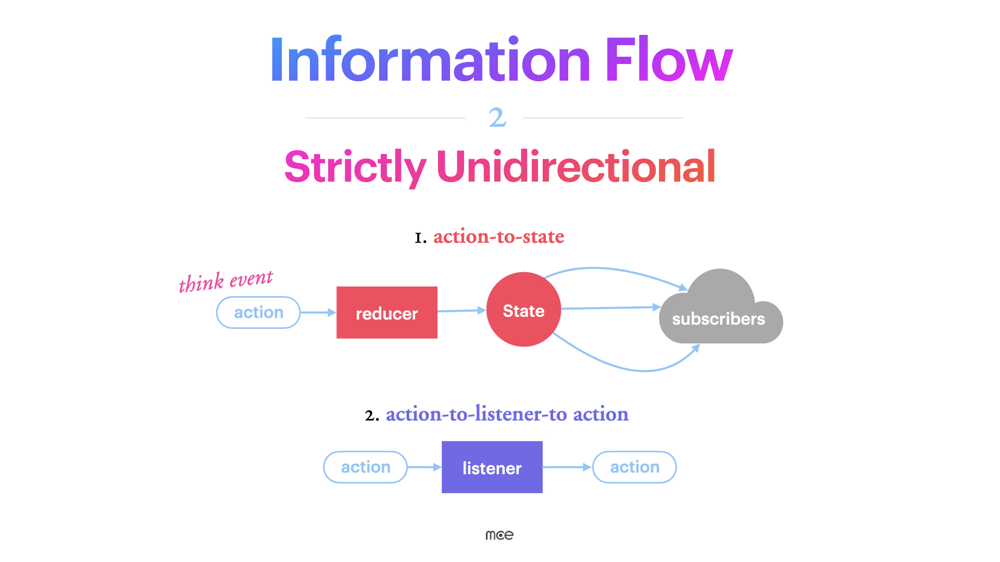
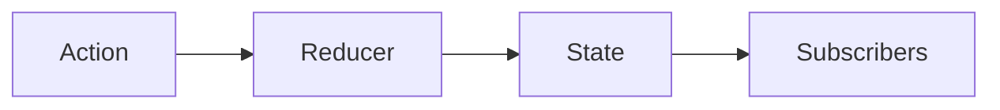
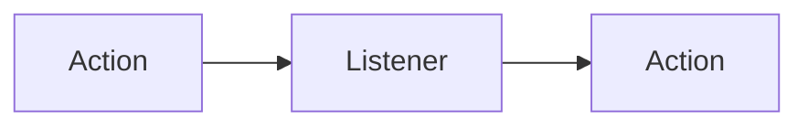
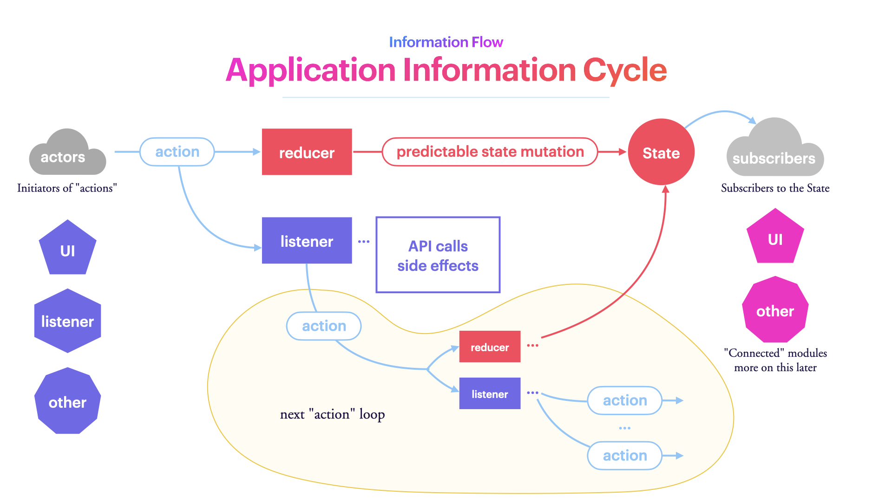
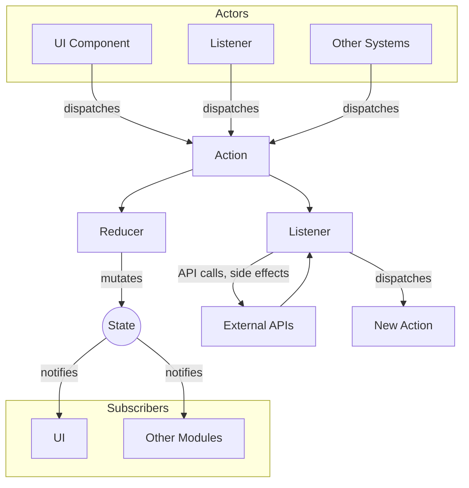
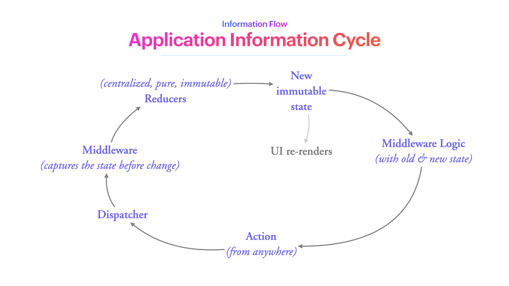
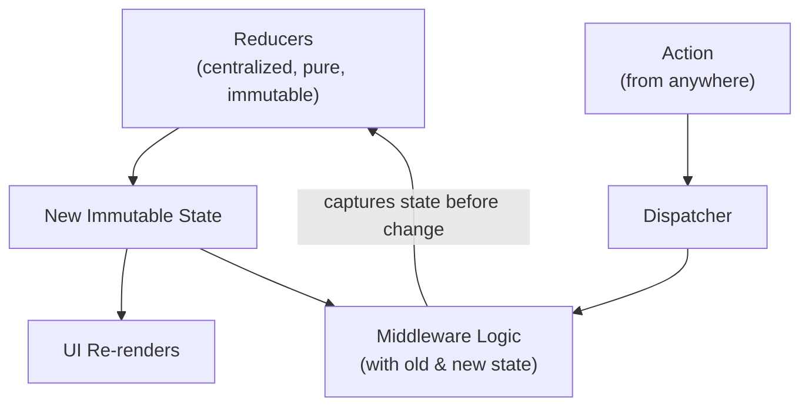
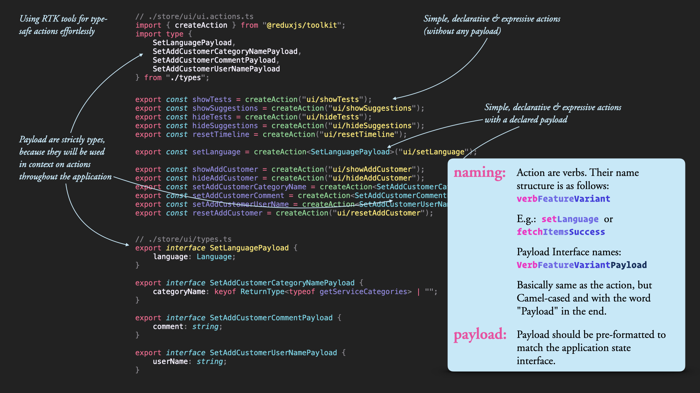

# Information Flow

> **Commandment II:** Strictly Unidirectional

---

## The Core Idea

Data flows in **one direction only**. Never backwards. Never sideways.

This is the single most important rule for keeping applications predictable. When you know exactly how data moves, you can trace any bug, understand any behavior, and confidently make changes.

---

## The Two Flows

There are exactly two ways information moves in a Ripe application:



### 1. Action → State



An action is dispatched. The reducer processes it and updates the state. Subscribers (components) react to the new state.

This is the primary flow. Think of actions as **events** that describe what happened.

### 2. Action → Listener → Action



Some actions trigger side effects: API calls, complex logic, or follow-up actions. Listeners handle these, then dispatch new actions when complete.

This is how async operations work. The listener is the bridge between the outside world and your state.

---

## The Application Information Cycle

Here's the complete picture:





**Actors** (things that initiate change):
- UI components
- Listeners
- External events

**The cycle:**
1. Actor dispatches an action
2. Reducer updates state (pure, synchronous)
3. Listeners react to the action (async, side effects)
4. Subscribers re-render based on new state
5. Listeners may dispatch follow-up actions

---

## The Redux Cycle (Simplified)





The middleware (where listeners live) sees both the old state and the new state. This is powerful: you can react to specific state transitions, not just actions.

---

## Application Vocabulary

Actions are the **vocabulary** of your application. They describe what can happen.

### Action Structure

Every action has the same shape:

```typescript
{
  type: "unique-string-action-name",
  payload: { /* data relevant to the action */ }
}
```

### Actions as Verbs

Action names are verbs. They declare **functional intent** or **report a change**:

```typescript
// Functional intent - something the user wants to do
showMenu
hideModal
setLanguage
addToCart

// Reporting - something that happened
fetchItemsSuccess
fetchItemsFailure
userLoggedIn
```

Reading the list of actions tells you what the application can do. It's self-documenting.

### Action Naming Convention

We follow a consistent pattern: **verbFeatureVariant**

```typescript
// Pattern: verbFeatureVariant
showTests
hideTests
setLanguage
fetchItemsSuccess
fetchItemsFailure

// With payload
setAddCustomerCategoryName
setAddCustomerComment
resetAddCustomer
```

### Payload Naming

Payload interfaces follow the action name, with "Payload" appended:

```typescript
// Action
export const setLanguage = createAction<SetLanguagePayload>("ui/setLanguage");

// Payload interface
export interface SetLanguagePayload {
  language: Language;
}
```

---

## Actions in Practice

Here's how actions are defined using Redux Toolkit:



> **Full example:** See [actions.example.ts](../examples/actions.example.ts)

```typescript
// ./store/ui/ui.actions.ts
import { createAction } from "@reduxjs/toolkit";
import type {
  SetLanguagePayload,
  SetAddCustomerCategoryNamePayload,
  SetAddCustomerCommentPayload,
  SetAddCustomerUserNamePayload,
} from "./types";

// Simple actions (no payload)
export const showTests = createAction("ui/showTests");
export const showSuggestions = createAction("ui/showSuggestions");
export const hideTests = createAction("ui/hideTests");
export const hideSuggestions = createAction("ui/hideSuggestions");
export const resetTimeline = createAction("ui/resetTimeline");

// Actions with payload
export const setLanguage = createAction<SetLanguagePayload>("ui/setLanguage");
export const showAddCustomer = createAction("ui/showAddCustomer");
export const hideAddCustomer = createAction("ui/hideAddCustomer");
export const setAddCustomerCategoryName = createAction<SetAddCustomerCategoryNamePayload>("ui/setAddCustomerCategoryName");
export const setAddCustomerComment = createAction<SetAddCustomerCommentPayload>("ui/setAddCustomerComment");
export const setAddCustomerUserName = createAction<SetAddCustomerUserNamePayload>("ui/setAddCustomerUserName");
export const resetAddCustomer = createAction("ui/resetAddCustomer");
```

And the corresponding types:

```typescript
// ./store/ui/types.ts
export interface SetLanguagePayload {
  language: Language;
}

export interface SetAddCustomerCategoryNamePayload {
  categoryName: keyof typeof getServiceCategories | "";
}

export interface SetAddCustomerCommentPayload {
  comment: string;
}

export interface SetAddCustomerUserNamePayload {
  userName: string;
}
```

---

## Dispatching Actions

Actions are dispatched from components, listeners, or other parts of the system:

```typescript
// From a component
const dispatch = useAppDispatch();

const handleLanguageChange = (language: Language) => {
  dispatch(setLanguage({ language }));
};

// From a listener
listenerMiddleware.startListening({
  actionCreator: userLoggedIn,
  effect: async (action, listenerApi) => {
    const user = await api.getUserProfile(action.payload.userId);
    listenerApi.dispatch(userProfileLoaded(user));
  },
});
```

---

## Why This Matters

Unidirectional flow gives us:

1. **Predictability** — You always know where data comes from and where it goes
2. **Debuggability** — Redux DevTools shows every action and state change
3. **Testability** — Each piece can be tested in isolation
4. **Traceability** — You can follow any data from source to display

When something goes wrong, you don't have to guess. You look at the actions, see the state changes, and find the problem.

---

## Common Mistakes

### Calling APIs Directly from Components

```typescript
// ❌ Don't do this
const Component = () => {
  const [data, setData] = useState(null);
  
  useEffect(() => {
    fetch('/api/data').then(res => setData(res));  // Side effect in component!
  }, []);
};

// ✅ Dispatch an action, let a listener handle it
const Component = () => {
  const dispatch = useAppDispatch();
  const data = useAppSelector(state => state.data);
  
  useEffect(() => {
    dispatch(fetchData());  // Listener handles the API call
  }, []);
};
```

### Two-Way Data Binding

```typescript
// ❌ Don't do this - component modifies state directly
<Input value={state.value} onChange={(v) => state.value = v} />

// ✅ Dispatch an action
<Input value={value} onChange={(v) => dispatch(setValue(v))} />
```

### Actions That Do Multiple Things

```typescript
// ❌ Don't create "god" actions
dispatch(doEverything({ user, items, settings, ui }));

// ✅ One action per concept
dispatch(setUser(user));
dispatch(setItems(items));
dispatch(updateSettings(settings));
```

---

## Summary

- **One direction** — Action → Reducer → State → View
- **Listeners for side effects** — Action → Listener → Action
- **Actions are vocabulary** — They describe what the application can do
- **Consistent naming** — verbFeatureVariant pattern
- **Formatted payloads** — Match the state structure

---

**Next:** [App Layers & Structure](04-app-structure.md)
