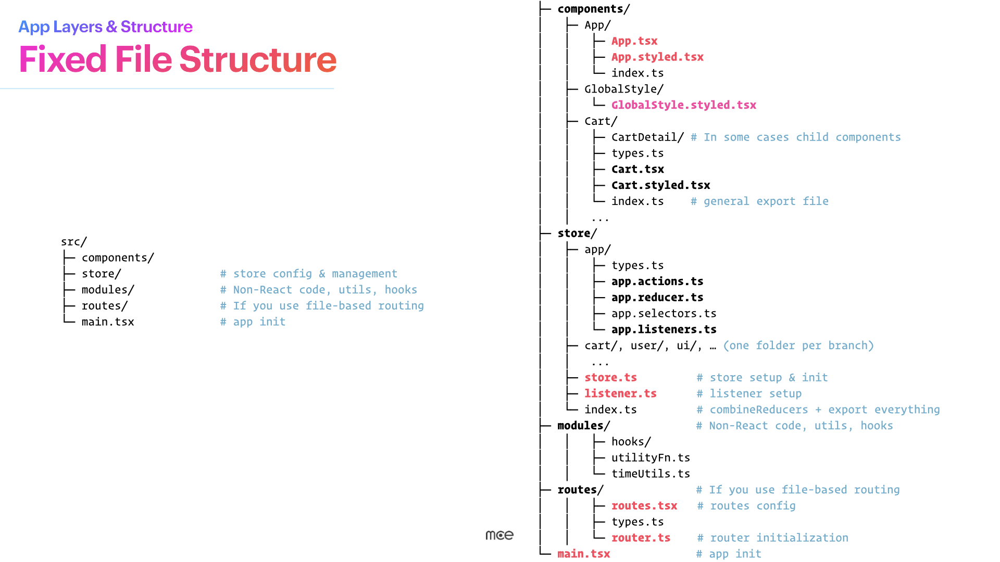
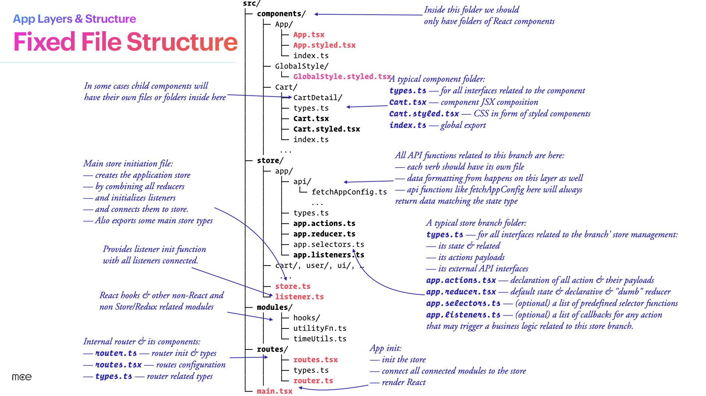

# App Layers & Structure

> **Commandment III:** Fixed File Structure

---

## The Core Idea

A rigid, **previously agreed upon** file and folder structure is the basic map of the project.

When you've seen one Ripe project, you can navigate any Ripe project. This consistency enables orientation during bootstrap and maintenance, regardless of the specific application.

---

## Top-Level Structure



Every Ripe application follows this layout:

```
src/
├── components/     # React components and their styles
├── store/          # State management (reducers, actions, selectors)
├── modules/        # Non-React utilities, hooks, helpers
├── routes/         # File-based routing (if applicable)
└── main.tsx        # Application entry point
```

Each folder has a specific purpose. Code doesn't go anywhere else.

---

## The Components Folder

This is where all React components live. **Only React components go here.**

```
components/
├── App/
│   ├── App.tsx              # The component
│   ├── App.styled.tsx       # Styled components
│   └── index.ts             # Public export
├── GlobalStyle/
│   └── GlobalStyle.styled.tsx
├── Cart/
│   ├── CartDetail/          # Child components can have subfolders
│   │   └── ...
│   ├── types.ts             # Component-specific types
│   ├── Cart.tsx             # The component
│   ├── Cart.styled.tsx      # Styles
│   └── index.ts             # Public export
└── ...
```

### A Typical Component Folder

| File | Purpose |
|------|---------|
| `types.ts` | Interfaces and types for this component |
| `ComponentName.tsx` | The component JSX composition |
| `ComponentName.styled.tsx` | Styled components (CSS) |
| `index.ts` | General export file |

### Naming Rules for Components

- **Folder names** — PascalCase (`Cart`, `UserProfile`, `GlobalStyle`)
- **Component files** — PascalCase (`Cart.tsx`, `Cart.styled.tsx`)
- **Index files** — Always `index.ts`

---

## The Store Folder



This is where state management lives. Each state branch gets its own folder.

```
store/
├── app/
│   ├── api/
│   │   └── fetchAppConfig.ts    # API functions for this branch
│   ├── types.ts                 # State and payload types
│   ├── app.actions.ts           # Action creators
│   ├── app.reducer.ts           # Default state and reducer
│   ├── app.selectors.ts         # Selector functions (optional)
│   └── app.listeners.ts         # Listener middleware (optional)
├── cart/
│   └── ...
├── user/
│   └── ...
├── ui/
│   └── ...
├── store.ts                     # Store setup and initialization
├── listener.ts                  # Listener middleware setup
└── index.ts                     # combineReducers + exports
```

### A Typical Store Branch Folder

| File | Purpose |
|------|---------|
| `types.ts` | State interface, action payloads, API response types |
| `branch.actions.ts` | All action creators for this branch |
| `branch.reducer.ts` | Default state and the reducer |
| `branch.selectors.ts` | Predefined selector functions (optional) |
| `branch.listeners.ts` | Business logic callbacks for actions (optional) |
| `api/` | External API integration functions |

### Naming Rules for Store

- **Folder names** — lowercase (`app`, `cart`, `user`)
- **Files** — lowercase, dot-separated (`app.actions.ts`, `app.reducer.ts`)
- **API files** — named after the function (`fetchAppConfig.ts`, `updateUser.ts`)

---

## The Modules Folder

Non-React code lives here: utilities, hooks, helper functions.

```
modules/
├── hooks/
│   └── useUserHydration.ts      # Custom hooks
├── utilityFn.ts                 # Utility functions
└── timeUtils.ts                 # More utilities
```

### Naming Rules for Modules

- **Files** — camelCase, reflecting the function name (`useUserHydration.ts`, `calculateSessionDuration.ts`)
- **Folders** — lowercase (`hooks`)

---

## The Routes Folder

If you use file-based routing:

```
routes/
├── routes.tsx       # Route configuration
├── types.ts         # Router-related types
└── router.ts        # Router initialization
```

---

## The Entry Point

```
main.tsx             # App initialization
```

This file:
- Initializes the store
- Connects all modules to the store
- Renders React

---

## Files & Folders Rules Summary

### Keep Files Short

Aim for **~100 lines** per file. If a file grows beyond that, split it into smaller, focused modules.

### Naming Conventions

| What | Convention | Example |
|------|------------|---------|
| Component folders | PascalCase | `Cart/`, `UserProfile/` |
| Component files | PascalCase | `Cart.tsx`, `Cart.styled.tsx` |
| Store folders | lowercase | `cart/`, `user/` |
| Store files | lowercase, dot-separated | `cart.actions.ts`, `cart.reducer.ts` |
| Modules/utils | camelCase | `useUserHydration.ts`, `timeUtils.ts` |
| All other folders | lowercase | `hooks/`, `api/` |

### Why This Matters

When you see a file name, you immediately understand:
- Its function
- Its place in the codebase
- What type of code it contains

```
store/user/api/fetchUserProfile.ts
```

Without opening it, you know:
- It's in the store layer
- It belongs to the user branch
- It's an API function
- It fetches user profile data

---

## Full Project Example

```
src/
├── components/
│   ├── App/
│   │   ├── App.tsx
│   │   ├── App.styled.tsx
│   │   └── index.ts
│   ├── GlobalStyle/
│   │   └── GlobalStyle.styled.tsx
│   └── Cart/
│       ├── CartDetail/
│       │   └── ...
│       ├── types.ts
│       ├── Cart.tsx
│       ├── Cart.styled.tsx
│       └── index.ts
├── store/
│   ├── app/
│   │   ├── api/
│   │   │   └── fetchAppConfig.ts
│   │   ├── types.ts
│   │   ├── app.actions.ts
│   │   ├── app.reducer.ts
│   │   ├── app.selectors.ts
│   │   └── app.listeners.ts
│   ├── cart/
│   │   └── ...
│   ├── user/
│   │   └── ...
│   ├── store.ts
│   ├── listener.ts
│   └── index.ts
├── modules/
│   ├── hooks/
│   │   └── useUserHydration.ts
│   ├── utilityFn.ts
│   └── timeUtils.ts
├── routes/
│   ├── routes.tsx
│   ├── types.ts
│   └── router.ts
└── main.tsx
```

---

## Common Mistakes

### Putting Logic in Components

```
// ❌ Don't create utility files in components/
components/
└── Cart/
    └── cartUtils.ts    # This belongs in modules/ or store/

// ✅ Keep components/ for React only
modules/
└── cartHelpers.ts
```

### Mixing Naming Conventions

```
// ❌ Inconsistent naming
store/
├── User/                    # Should be lowercase
├── cart.Actions.ts          # Should be cart.actions.ts
└── fetch-products.ts        # Should be fetchProducts.ts

// ✅ Consistent naming
store/
├── user/
├── cart.actions.ts
└── fetchProducts.ts
```

### Deep Nesting

```
// ❌ Too deep
components/Cart/Items/ItemList/ItemRow/ItemCell/...

// ✅ Flatten where possible
components/Cart/CartItem/...
```

---

## Summary

- **Fixed structure** — Every Ripe project follows the same layout
- **Four main folders** — `components/`, `store/`, `modules/`, `routes/`
- **Consistent naming** — PascalCase for components, lowercase for store, camelCase for modules
- **Short files** — ~100 lines max, split when larger
- **Self-documenting** — File names tell you what's inside

---

**Next:** [Functional Layers](05-functional-layers.md)
