# The Ripe Method

**A complete guide to the front-end architecture that makes you want to write more code.**

*By Yehuda Gilead, 2026*


---

## Before We Start: Ask "Why?"

Every architecture document starts with a diagram and a bullet list. Not this one.

This one starts with a dare: **ask "why?"** about everything you read here. If something doesn't make sense, challenge it. If a rule feels arbitrary, demand the reasoning. The Ripe Method isn't a religion — it's a set of battle-tested decisions, and every single one has a reason behind it.

The moment you stop asking "why?" is the moment your code starts rotting.

So. Let's go.

---

## Part I: The Why

### Three Things We Want

Strip away the jargon and the architecture astronautics, and what we actually want is embarrassingly simple:

| # | We want to... | Because... |
|---|--------------|------------|
| 1 | **Be ready for the future** | Real pros evolve. They capitalize on the future, build timeless solutions, and make themselves irreplaceable. |
| 2 | **Ship highest-quality software** | We are masters of craft. High quality is our brand. It's the only relevant way to be significant. |
| 3 | **Crave to build more stuff** | We love our work. It's fun. It empowers us, sparks creativity, and doesn't wear us down. |

That last one is the sneaky important one. An architecture that makes you *dread* opening your editor has already failed, no matter how "correct" it is.

### The Agent Angle

Here's the 2026 twist: we don't just write code anymore. We **build teams of agents that build**. The architecture needs to be readable by humans *and* parseable by bots. If your codebase can't be understood by an LLM with a 128k context window, it probably can't be understood by a junior engineer at 4pm on a Friday either.

This isn't a nice-to-have. This is professional identity.

---

## Part II: Maintenance is 95% of the Game

Here's a number that should haunt you: **95%** of a software product's life is spent in maintenance. Not in the glorious greenfield phase where everything is possible and nothing is broken. In the long, unglamorous slog of fixing, extending, and keeping things alive.

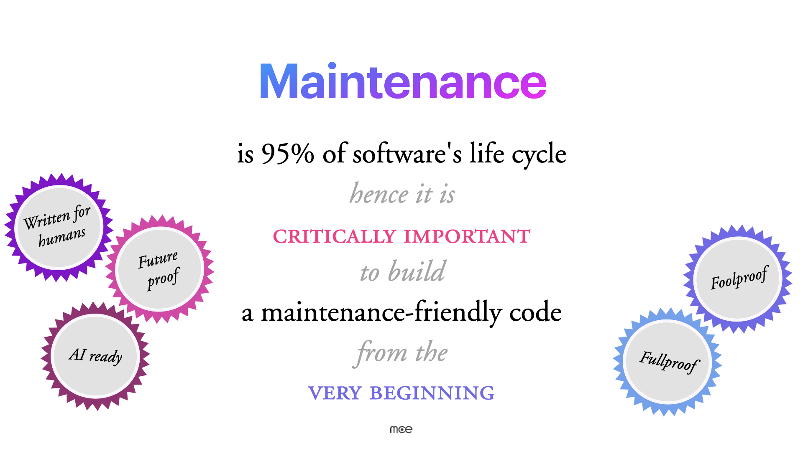

This means every architectural decision must be evaluated through one lens: *"Will this make maintenance easier or harder?"*

The Ripe architecture is built to produce code that is:

- **Written for humans** — Your future self is the primary audience
- **Future-proof** — New requirements don't require rewrites
- **AI-ready** — Agents can navigate and modify the codebase
- **Foolproof** — Hard to misuse, easy to use correctly
- **Chaos-ready** — Graceful under pressure, resilient by design
- **Agent-ready** — Structured for automated maintenance and generation

If that sounds like a lot of badges on a scout uniform, think of it this way: we're optimizing for the 95%, not the 5%.

---

## Part III: Simple is Key


Here's the entire philosophy in four words. Not "clever is key." Not "flexible is key." Not "abstract is key."

**Simple.**

A paracord bracelet is made from a single strand of cord. It's robust, practical, and you can take it apart when you need the rope. That's the vibe we're going for. Every piece of the architecture should be:

- Easy to understand in isolation
- Easy to compose with other pieces
- Easy to replace without breaking everything else

The moment something feels complicated, that's a signal. Step back. Simplify. The architecture should absorb complexity so that your day-to-day code stays flat and predictable.

### Flat Complexity

This is a core principle worth calling out explicitly. As your application grows, its **functional complexity** will naturally increase — more features, more screens, more data. That's expected. But the **technical complexity** — the cognitive load of understanding how the code works — should remain flat.

```
Functional complexity:  ↗ (grows with features — that's fine)
Technical complexity:   → (stays flat — that's the goal)
```

If adding a new feature requires understanding a new pattern, a new abstraction, or a new way of doing things — something has gone wrong. Every feature should follow the same patterns you already know.

---

## Part IV: The 16 Elements

Before we dive into the mechanics, here's the full set of principles that guide every decision in the Ripe Method. Think of these as the DNA — they reinforce each other and together create the architecture's character.

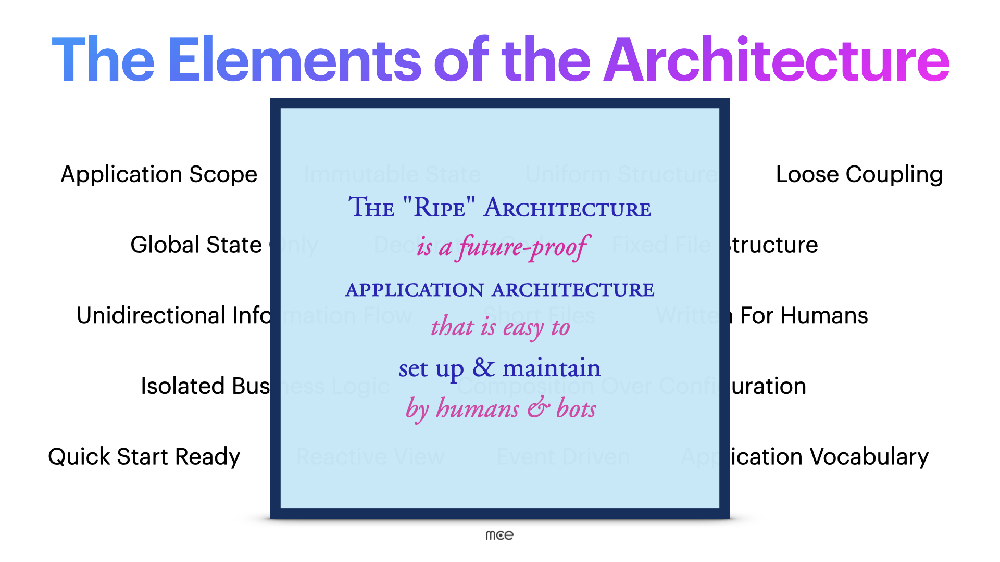

### State & Data

| Element | What it means |
|---------|---------------|
| **Application Scope** | Every feature belongs to a defined scope. Boundaries are clear. |
| **Immutable State** | Never mutate state directly. Create new versions. |
| **Global State Only** | One source of truth: the global store. No local state for app data. |

### Code Style

| Element | What it means |
|---------|---------------|
| **Declarative Code** | Describe *what* you want, not *how* to get it. |
| **Written For Humans** | Optimize for readability. Clear names, short functions, obvious logic. |
| **Short Files** | ~100 lines per file. If it's longer, split it. |

### Structure

| Element | What it means |
|---------|---------------|
| **Uniform Structures** | Similar things look similar. Every component folder, every store branch — same shape. |
| **Fixed File Structure** | Same folder layout, every project. Navigate blindfolded. |
| **Loose Coupling** | Modules depend on abstractions, not implementations. |

### Data Flow

| Element | What it means |
|---------|---------------|
| **Unidirectional Flow** | Data flows one direction: Action → Reducer → State → View. Never backwards. |
| **Reactive View** | The view reacts to state. It doesn't fetch, compute, or decide. |
| **Event Driven** | User interactions trigger actions. Actions describe what happened. |

### Logic & Composition

| Element | What it means |
|---------|---------------|
| **Isolated Business Logic** | All logic lives in listeners. Not scattered across components. |
| **Composition Over Configuration** | Build complex features by combining simple pieces. |
| **Quick Start Ready** | Clone, install, run. No tribal knowledge required. |

### Vocabulary

| Element | What it means |
|---------|---------------|
| **Application Vocabulary** | Actions are the feature spec. Reading them tells you what the app can do. |

These elements aren't independent — they reinforce each other. Immutable state enables reactive views. Fixed file structure supports uniform structures. Declarative code makes things written for humans.

---

## Part V: The State Machine Problem

Let's get technical.

Every application, no matter how fancy the UI, is fundamentally a **state machine**. It has data. That data changes. The UI reflects those changes. That's it. That's the whole game.

The Ripe Method reduces the entire application to this one basic software engineering problem — and solves it with **Flux**, specifically its most popular evolution: **Redux** (via [Redux Toolkit](https://redux-toolkit.js.org/)).

### Why Redux in 2026?

Fair question. With Zustand, Jotai, Signals, and whatever dropped on npm last Tuesday, why Redux?

Because Redux gives us something the others don't: **a complete, opinionated information cycle** with middleware, time-travel debugging, and a massive ecosystem. It's not the lightest tool. It's the most *predictable* tool. And predictability is what you want when 12 people are working on the same codebase and half of them are AI agents.

> Redux was created by Dan Abramov and Andrew Clark in 2015 as an evolution of Flux. It uses a **single centralized store**, **pure reducer functions**, and **actions to describe changes** — creating a unidirectional data flow.

### The Flow

Here's the core loop, and you'll see it everywhere:

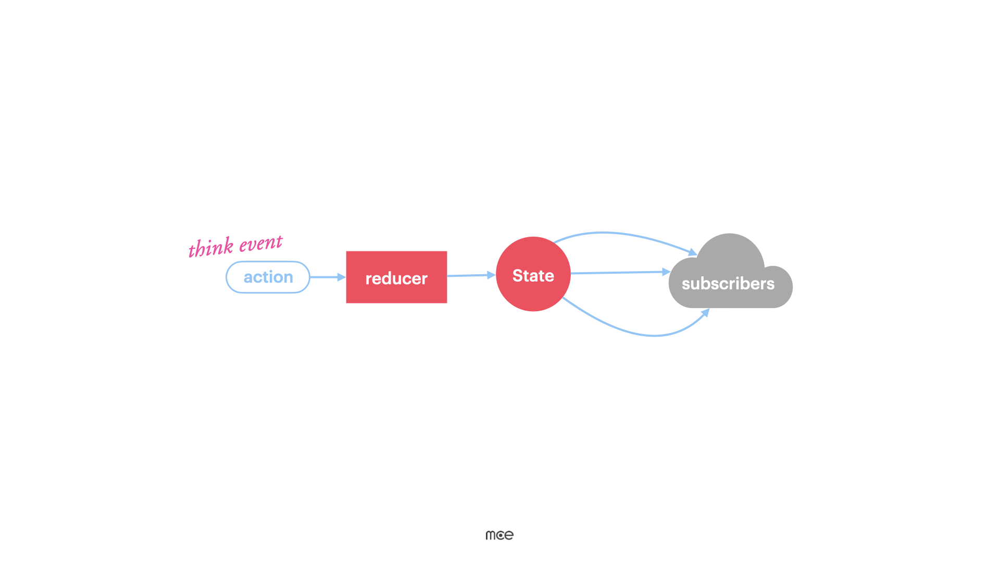

```
Event → Action → Reducer → State → Subscribers (UI)
```

1. Something happens (a click, an API response, a timer)
2. An **action** is dispatched — a plain object describing what happened
3. A **reducer** takes the current state + the action and returns a new state
4. **Subscribers** (React components) re-render based on the new state

That's the whole thing. One direction. No backsies. No spaghetti.

### The Full Picture (With Listeners)

In practice, there's a second flow for side effects:

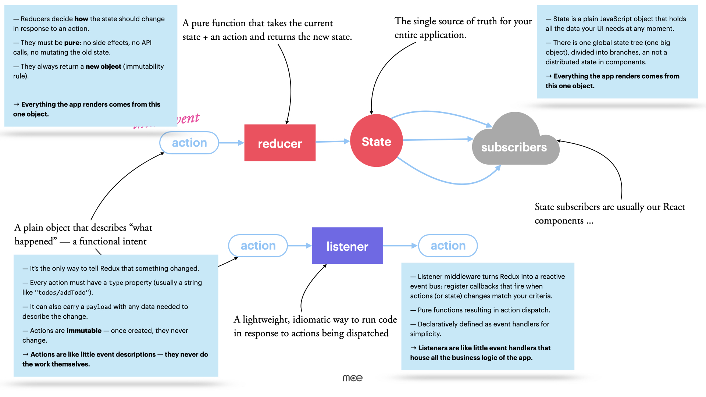

```
Action → Listener → API / side effects → New Action → Reducer → State → Subscribers
```

**Listeners** are where the interesting stuff happens — API calls, complex decisions, orchestration. They listen for specific actions, do async work, and dispatch new actions when done. More on these later. They're the secret sauce.

---

## Part VI: Three Layers, One Architecture

The Ripe architecture divides all code into **three concentric layers**:

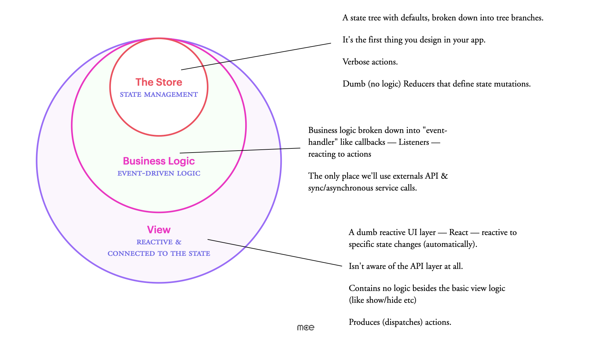

| Layer | What it does | What it doesn't do |
|-------|-------------|-------------------|
| **The Store** (innermost) | Holds state, defines actions, simple reducers | Logic, API calls, decisions |
| **Business Logic** (middle) | API calls, complex decisions, orchestration | Rendering, direct state mutation |
| **View** (outermost) | Renders UI, dispatches actions | Logic, API calls, state management |

The rule is simple: **push complexity inward**. The View is dumb. The Reducers are dumb. All the "thinking" happens in the Business Logic layer (listeners).

### The Store — State Management

This is the core. The first thing you design in your app.

- **State tree with defaults**, broken into branches (one per feature)
- **Verbose, declarative actions** — they describe intent
- **Dumb reducers** — no logic, only simple assignment and removal
- **Selectors** for cached state access

### Business Logic — Event-Driven Logic

This is where the magic happens. Listeners react to actions and orchestrate everything:

- **View-agnostic** — doesn't know about components
- **Deliberately isolated** — logic is contained, not scattered
- **Declarative, event-driven** — reacts to actions, dispatches new ones
- **Only Redux actions trigger logic** — no sneaky direct function calls from views
- API calls and external integrations live here exclusively

### View — Reactive & Connected to State

The outermost layer. A dumb, reactive UI:

- **Passive** — only reacts to state changes
- **Declarative** — composes the user experience
- **No logic** — besides basic show/hide
- **Dispatches actions** — that's how it communicates with the rest of the app
- **Not aware of the API layer** at all

### How the Layers Interact

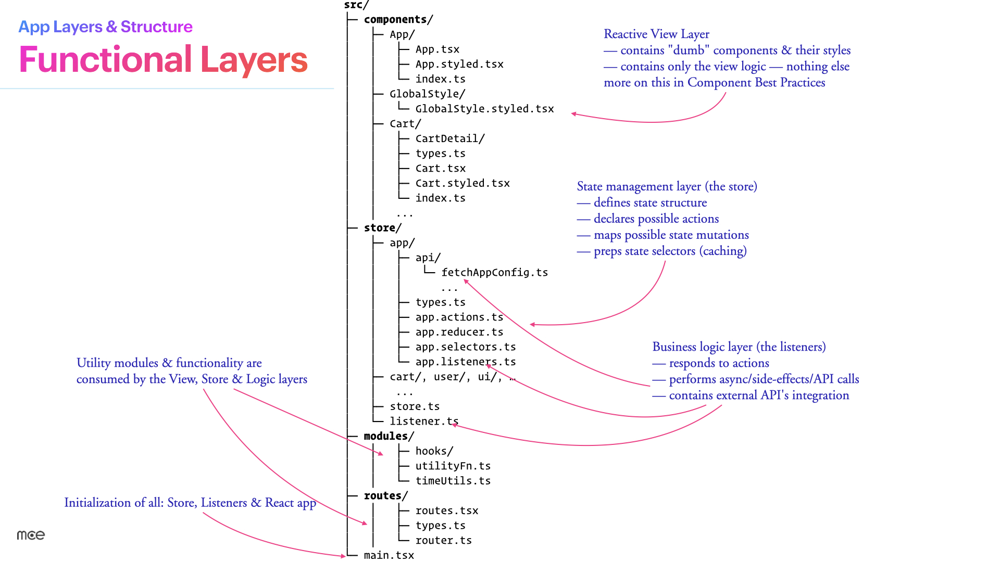

```
┌─────────────────────────────────────────────┐
│  VIEW (components/)                         │
│  Reads state via selectors                  │
│  Dispatches actions on user interaction     │
│                                             │
│  ┌─────────────────────────────────────┐    │
│  │  BUSINESS LOGIC (listeners + api/)  │    │
│  │  Reacts to actions                  │    │
│  │  Calls APIs, makes decisions        │    │
│  │  Dispatches follow-up actions       │    │
│  │                                     │    │
│  │  ┌─────────────────────────────┐    │    │
│  │  │  STORE (actions, reducers)  │    │    │
│  │  │  Holds state                │    │    │
│  │  │  Defines the vocabulary     │    │    │
│  │  │  Simple mutations only      │    │    │
│  │  └─────────────────────────────┘    │    │
│  └─────────────────────────────────────┘    │
└─────────────────────────────────────────────┘
```

---

## Part VII: Global State Composition

> **Commandment I:** Envision One Global Application State

### The Definition

The State is the **one global map** of everything your application needs to reflect to the user. Imagine a config JSON. If you printed the whole thing, you'd see every piece of data your app displays.

### The Mindset

Every time you're about to add a feature:

> *"What state changes will this feature require?"*

Describe the state first. Then write the code. Always.

### The Six Rules

1. **Single source of truth.** No in-component state for app data.
2. **Reflects everything** you're about to show to your user.
3. **Optimized for quick fetching.** Arrays for order, objects for O(1) lookup.
4. **Caching computed on mutation.** Not on read.
5. **Features have their own branch.** Cart gets `cart`, user gets `user`.
6. **Always comes with defaults.** No undefined states. Ever.

### What It Looks Like

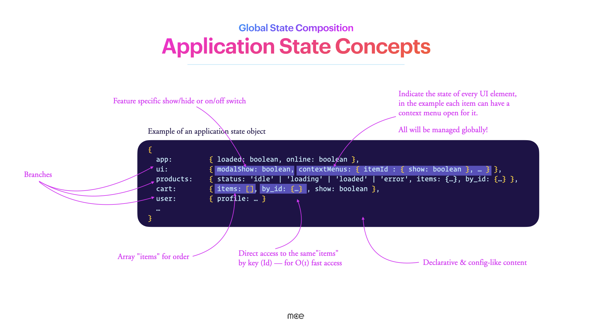

```typescript
{
  app: {
    loaded: true,
    online: true,
  },
  ui: {
    modalShow: false,
    contextMenus: { "item-42": { show: true } },
  },
  products: {
    status: "loaded",      // 'idle' | 'loading' | 'loaded' | 'error'
    items: ["p1", "p2"],   // Array for order
    byId: {                // Object for O(1) lookup
      p1: { id: "p1", name: "Widget", price: 9.99 },
      p2: { id: "p2", name: "Gadget", price: 19.99 },
    },
  },
  cart: {
    items: ["p1"],
    byId: { p1: { quantity: 2 } },
    show: true,
  },
  user: {
    profile: { name: "Ada", role: "admin" },
  },
}
```

Notice the patterns:

- **Branches** — top-level keys group related state
- **Dual structures** — `items` array for order + `byId` object for fast lookup
- **Status flags** — explicit loading states, not booleans
- **UI state** — even modal visibility lives in the store
- **Declarative, config-like** — reads like a description of the app

### Why Dual Structures?

This is a pattern worth explaining. When you have a list of items, you need two things:

1. **Order** — which item comes first? (array: `items: ["p1", "p2"]`)
2. **Fast lookup** — given an ID, get the full item (object: `byId: { p1: {...} }`)

An array gives you order but O(n) lookup. An object gives you O(1) lookup but no order. So we use both. The array stores IDs in order, the object stores the actual data keyed by ID.

```typescript
// Rendering a list in order:
state.products.items.map(id => state.products.byId[id])

// Looking up a single item:
state.products.byId["p1"]  // O(1), instant
```

### Mutations: Reducers Only

State changes go through reducers. Period. And reducers are *dumb*:

```typescript
builder
  .addCase(getDevices, (state) => {
    state.loading = LoadingStates.LOADING;
  })
  .addCase(getDevicesSuccess, (state, action) => {
    state.loading = LoadingStates.SUCCESS;
    state.items = action.payload.items;
    state.byId = action.payload.byId;
  })
  .addCase(getDevicesFailure, (state) => {
    state.loading = LoadingStates.ERROR;
  });
```

No `if` statements. No transformations. No API calls. The payload arrives pre-formatted to match the state shape. The reducer just slots it in.

### Common Mistakes with State

**Storing derived data:**

```typescript
// ❌ Don't store computed values in state
state.totalPrice = state.items.reduce((sum, item) => sum + item.price, 0);

// ✅ Compute in a selector instead
const selectTotalPrice = (state: RootState) =>
  state.cart.items.reduce((sum, item) => sum + item.price, 0);
```

**Duplicating data across branches:**

```typescript
// ❌ Same data in two places — will drift
state.user.cartItems = [...];  // Already in cart.items!

// ✅ Reference by ID
state.user.cartItemIds = ["p1", "p2"];
```

---

## Part VIII: Information Flow

> **Commandment II:** Strictly Unidirectional

### Two Flows, No More

**Flow 1: Action → State** (the primary path)

```
Action → Reducer → State → Subscribers (UI)
```

**Flow 2: Action → Listener → Action** (the side-effect path)

```
Action → Listener → New Action
```

That's it. There is no Flow 3. If you find yourself inventing a third path, you're doing it wrong.

### The Application Information Cycle

Here's the complete picture of how data moves through a Ripe app:

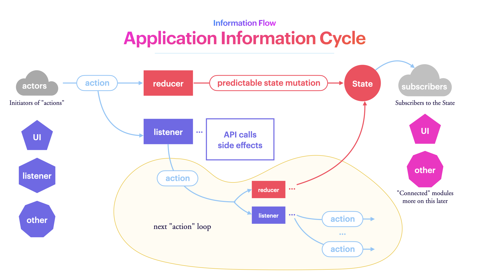

**Actors** (UI, listeners, external events) dispatch **actions**. Actions flow to **reducers** (which update state) and to **listeners** (which handle side effects). Listeners make API calls, then dispatch new actions with the results. The **state** updates, **subscribers** re-render. Rinse and repeat.

The "next action loop" is the key insight: listeners can trigger chains of actions, but the flow is always the same shape. Always unidirectional. Always traceable.

### Application Vocabulary

Actions are the **vocabulary** of your application. Reading the action list tells you everything the app can do:

```typescript
showMenu
hideModal
setLanguage
addToCart
fetchItemsSuccess
fetchItemsFailure
userLoggedIn
```

Every action is a plain object with a `type` and an optional `payload`:

```typescript
{ type: "cart/addItem", payload: { productId: "p1", quantity: 1 } }
```

### Naming Convention

Actions are verbs. Always. The pattern is **`verbFeatureVariant`**:

| Action | Payload Interface |
|--------|------------------|
| `setLanguage` | `SetLanguagePayload` |
| `fetchItemsSuccess` | `FetchItemsSuccessPayload` |
| `showAddCustomer` | *(none)* |
| `resetTimeline` | *(none)* |

The payload interface name is the action name in PascalCase + "Payload". Simple, predictable, greppable.

```typescript
// store/ui/ui.actions.ts
import { createAction } from "@reduxjs/toolkit";

export const showTests = createAction("ui/showTests");
export const hideTests = createAction("ui/hideTests");
export const setLanguage = createAction<SetLanguagePayload>("ui/setLanguage");
```

```typescript
// store/ui/types.ts
export interface SetLanguagePayload {
  language: Language;
}
```

Payloads should be **pre-formatted to match the state structure**. The reducer shouldn't have to think about data shape — that's the listener's job.

---

## Part IX: Fixed File Structure

> **Commandment III:** One Structure to Rule Them All

### The Principle

A rigid, **previously agreed upon** file and folder structure is the basic map of the project. When you've seen one Ripe project, you can navigate any Ripe project. Blindfolded. At 2am. During an incident.

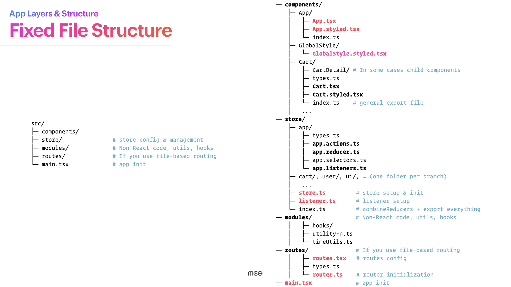

### The Layout

```
src/
├── components/     # React components and their styles
├── store/          # State management (the whole enchilada)
├── modules/        # Non-React utilities, hooks, helpers
├── routes/         # Routing config (if file-based)
└── main.tsx        # App initialization (store, listeners, React)
```

Four folders and an entry point. That's the entire top level.

### Components — The View Layer

Only React components live here. Nothing else.

```
components/
├── App/
│   ├── App.tsx              # The component
│   ├── App.styled.tsx       # Styled components
│   └── index.ts             # Public export
├── GlobalStyle/
│   └── GlobalStyle.styled.tsx
└── Cart/
    ├── CartDetail/          # Child components get subfolders
    ├── types.ts             # Component-specific types
    ├── Cart.tsx
    ├── Cart.styled.tsx
    └── index.ts
```

### Store — The Brain

Each state branch gets its own folder with a predictable set of files:

```
store/
├── app/
│   ├── api/
│   │   └── fetchAppConfig.ts   # API functions for this branch
│   ├── types.ts                # State shape, payload interfaces, API types
│   ├── app.actions.ts          # Action creators
│   ├── app.reducer.ts          # Default state + reducer
│   ├── app.selectors.ts        # Selector functions (optional)
│   └── app.listeners.ts        # Business logic callbacks (optional)
├── cart/  ...
├── user/  ...
├── ui/    ...
├── store.ts                    # Store setup & initialization
├── listener.ts                 # Listener middleware setup
└── index.ts                    # combineReducers + export everything
```

The `api/` subfolder inside each branch is where external API functions live. Each verb gets its own file. Data formatting happens here too — by the time data reaches a reducer, it's already shaped for the state.

### Types Live Next to Usage

Types and interfaces are defined in a `types.ts` file **adjacent to where they're used**. Store branch types live in `store/cart/types.ts`. Component-specific types live in `components/Cart/types.ts`. Never in a global `types/` folder far from the code that uses them.

```
store/cart/
├── types.ts              ← Cart state shape, payload types, API response types
├── cart.actions.ts        ← imports from ./types.ts
├── cart.reducer.ts        ← imports from ./types.ts
└── cart.listeners.ts      ← imports from ./types.ts
```

This keeps the type definitions close to the code that depends on them, making refactoring local and safe.

### Modules — The Toolbox

Non-React code: utilities, hooks, helpers.

```
modules/
├── hooks/
│   └── useUserHydration.ts
├── calculateSessionDuration.ts
└── timeUtils.ts
```

### Functional Layers Mapped to Folders


| Layer | Folder(s) | Responsibility |
|-------|-----------|---------------|
| **Reactive View** | `components/` | Dumb components + styles, view logic only |
| **State Management** | `store/*/` (actions, reducer, selectors, types) | State structure, actions, mutations, caching |
| **Business Logic** | `store/*/listeners.ts` + `store/*/api/` | Side effects, API calls, orchestration |
| **Utilities** | `modules/` | Consumed by all layers |
| **Initialization** | `main.tsx` | Store, listeners, React app bootstrap |

### Naming Rules

| What | Convention | Example |
|------|-----------|---------|
| Component folders & files | PascalCase | `Cart/`, `Cart.tsx`, `Cart.styled.tsx` |
| Store folders & files | lowercase, dot-separated | `cart/`, `cart.actions.ts` |
| Module files | camelCase, reflects function | `useUserHydration.ts`, `timeUtils.ts` |
| Everything else | lowercase | `types.ts`, `index.ts` |

**File length target: ~100 lines.** If a file grows beyond that, split it. Short files are readable files.

The payoff: when you see `store/user/api/fetchUserProfile.ts`, you know — without opening it — that it's an API function in the store layer, belonging to the user branch, that fetches a user profile. The file name *is* the documentation.

---

## Part X: The Reactive View

### The Philosophy

The View layer doesn't *do* things. It *reflects* things.

When a user clicks a button, the component doesn't perform the action — it dispatches an action that *describes* what the user wants. The listener handles the actual work. The component just sits there, looking pretty, waiting for the state to change.

Five rules:

1. **Passive & reactive** — only reacts to state changes
2. **Declaratively composes** the user experience
3. **As "dumb" as you can manage** — no application logic inside
4. **Can show stuff and dispatch actions** — nothing more
5. **Semantically easy to understand** — it's the first point of contact for maintenance

### Anatomy of a Component

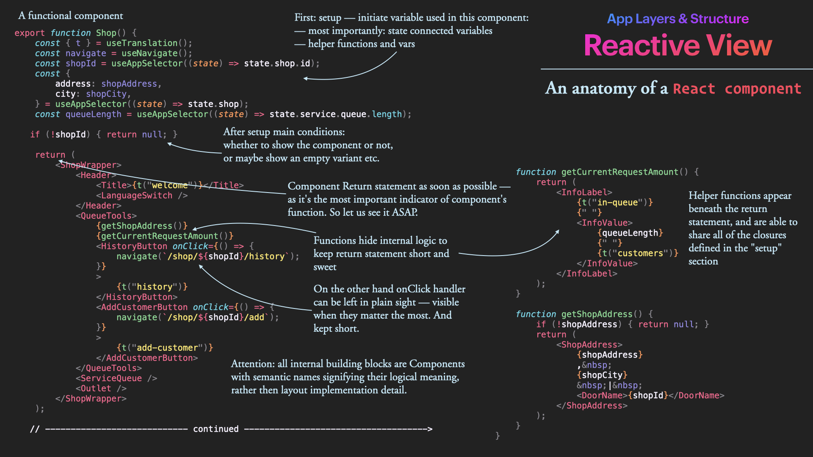

Here's the structure of a well-written Ripe component:

```typescript
export function Shop() {
  // ═══ SETUP ═══
  const { t } = useTranslation();
  const navigate = useNavigate();
  const shopId = useAppSelector((state) => state.shop.id);
  const { address: shopAddress, city: shopCity } = useAppSelector((state) => state.shop);
  const queueLength = useAppSelector((state) => state.service.queue.length);

  // ═══ EARLY EXIT ═══
  if (!shopId) {
    return null;
  }

  // ═══ RETURN ═══
  return (
    <ShopWrapper>
      <Header>
        <Title>{t("welcome")}</Title>
        <LanguageSwitch />
      </Header>

      <QueueTools>
        {getShopAddress()}
        {getCurrentRequestAmount()}
        <HistoryButton onClick={() => navigate(`/shop/${shopId}/history`)}>
          {t("history")}
        </HistoryButton>
        <AddCustomerButton onClick={() => navigate(`/shop/${shopId}/add`)}>
          {t("add-customer")}
        </AddCustomerButton>
      </QueueTools>

      <ServiceQueue />
      <Outlet />
    </ShopWrapper>
  );

  // ═══ HELPERS ═══
  function getCurrentRequestAmount() {
    return (
      <InfoLabel>
        {t("in-queue")} <InfoValue>{queueLength}</InfoValue> {t("customers")}
      </InfoLabel>
    );
  }

  function getShopAddress() {
    if (!shopAddress) return null;
    return (
      <ShopAddress>
        {shopAddress} | {shopCity} | <DoorName>{shopId}</DoorName>
      </ShopAddress>
    );
  }
}
```

The structure is always the same:

1. **Setup** — hooks, selectors, variables
2. **Early returns** — guard clauses for empty/loading states
3. **Return statement** — the JSX, **as early as possible**
4. **Helper functions** — below the return, sharing closures from setup

### The Return Statement: Get There Fast

This deserves emphasis. The `return` statement is the **most important part** of a component — it tells you what this component *is*. Everything before it is setup. Everything after it is supporting detail. The reader should reach the JSX as quickly as possible.

If your component has 40 lines of logic before the `return`, that logic probably belongs in a listener or a custom hook.

### Semantic JSX: No Raw HTML

Notice the component names: `<ShopWrapper>`, `<QueueTools>`, `<ServiceQueue>` — not `<div>`, `<section>`, `<span>`. The JSX return should contain **only semantic Styled Components** with clear names that describe their purpose. No raw HTML tags mixed in.

```typescript
// ✅ Semantic — reads like a description of the page
return (
  <ProductPageWrapper>
    <ProductHeader>
      <ProductTitle>{product.name}</ProductTitle>
      <PriceTag>{formatPrice(product.price)}</PriceTag>
    </ProductHeader>
    <ProductGallery images={product.images} />
    <AddToCartButton onClick={() => dispatch(addToCart(product.id))}>
      {t("add-to-cart")}
    </AddToCartButton>
  </ProductPageWrapper>
);

// ❌ Implementation detail — reads like a DOM dump
return (
  <div className="product-page">
    <div className="header">
      <h1>{product.name}</h1>
      <span className="price">{formatPrice(product.price)}</span>
    </div>
    <div className="gallery">
      {product.images.map(img => )}
    </div>
    <button onClick={() => dispatch(addToCart(product.id))}>
      {t("add-to-cart")}
    </button>
  </div>
);
```

When you read `<ProductHeader>`, you know what it is. When you read `<div className="header">`, you have to *infer* what it is. The first version is self-documenting. The second requires mental parsing.

Short `onClick` handlers can stay inline. Complex ones get extracted. The goal is always: *can I understand what this component does in 5 seconds?*

---

## Part XI: Business Logic — Where the Magic Happens

### The Listener Layer

This is the heart of the Ripe architecture. While the View is dumb and the Reducers are dumb, the **listeners** are where all the interesting decisions happen.

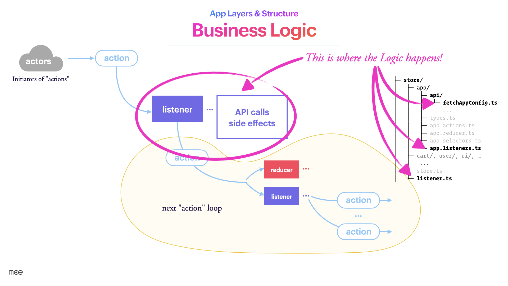

We use Redux Toolkit's [Listener Middleware](https://redux-toolkit.js.org/api/createListenerMiddleware) — a lightweight, idiomatic way to run code in response to dispatched actions. Think of it as turning Redux into a **reactive event bus**.

### The Anatomy of a Listener

A listener is a simple object: *"if this action was dispatched, execute this effect."*

```typescript
{
  actionCreator: userLoggedIn,
  effect: async (action, listenerApi) => {
    // action — the event: its type and payload
    // listenerApi — injects dispatch, getState, getOriginalState
  }
}
```

That's it. An event name and a callback. The callback gets two things:

- **`action`** — the dispatched action (type + payload)
- **`listenerApi`** — your toolkit: `dispatch()`, `getState()`, `getOriginalState()`, `cancelActiveListeners()`, and more

### The Four Patterns

**Pattern 1: Listen to a specific action** *(most common)*

```typescript
listenerMiddleware.startListening({
  actionCreator: userLoggedIn,
  effect: async (action, listenerApi) => {
    listenerApi.dispatch(showWelcomeToast());

    const user = await api.getUserProfile(action.payload.userId);
    listenerApi.dispatch(userProfileLoaded(user));
  },
});
```

**Pattern 2: Listen to several actions at once**

```typescript
listenerMiddleware.startListening({
  matcher: isAnyOf(userLoggedIn, userLoggedOut, tokenExpired),
  effect: async (_, { dispatch }) => {
    dispatch(refreshSidebar());
    dispatch(checkNotifications());
  },
});
```

**Pattern 3: Listen by predicate** *(great for catching patterns)*

```typescript
listenerMiddleware.startListening({
  predicate: (action) => action.type.endsWith("/rejected"),
  effect: async (action) => {
    const error = action.payload as ApiError;
    console.error("API Error:", error);
  },
});
```

**Pattern 4: Cancel previous effects** *(perfect for search/autocomplete)*

```typescript
listenerMiddleware.startListening({
  actionCreator: searchQueryChanged,
  effect: async (action, { cancelActiveListeners, dispatch }) => {
    cancelActiveListeners();

    const results = await api.search(action.payload);
    dispatch(searchResultsLoaded(results));
  },
});
```

### Real-World Listener File

Here's what a production listener file looks like:

```typescript
// store/service/service.listeners.ts
export const listeners: Listener[] = [
  {
    actionCreator: getServiceQueue,
    effect: async (_, listenerApi) => {
      const shopId = listenerApi.getState().shop.id;

      if (!shopId) {
        listenerApi.dispatch(getServiceQueueFailure({ error: "No shop id found" }));
        return;
      }

      try {
        const requests = await fetchServiceRequests(shopId);
        listenerApi.dispatch(getServiceQueueSuccess({ ...requests }));
      } catch (e) {
        listenerApi.dispatch(getServiceQueueFailure({ error: "Failed to fetch requests" }));
      }
    },
  },
  {
    actionCreator: statusSkip,
    effect: async (action, { dispatch, getState }) => {
      const shopId = getState().shop.id;
      if (!shopId) {
        dispatch(getServiceQueueFailure({ error: "No shop id found" }));
        return;
      }

      const { reason, comment } = getState().ui.skipCustomer;
      const reasonText = `${reason}\n----\n${comment}`;

      try {
        await updateServiceRequestStatus(
          shopId, action.payload.id, EntityStatus.Skipped, reasonText
        );
        dispatch(resetSkipCustomer());
      } catch (e) {
        console.error(e);
      }
    },
  },
];
```

The pattern is always the same: check preconditions, do async work, dispatch success or failure. No surprises. No hidden magic. Just straightforward event handling.

---

## Part XII: Global Uniformity

### The Binding Convention

When there's **one state**, and **one language** for all, all logic is managed event-driven only by **listeners**, the UI is just a **dumb reflection**, all files are **short and sweet**, folder structure is **clearly defined**, and even by the name of any file **you know where it belongs** and what it should do...

...you get **uniformity**. Between projects. Between features inside projects. Between humans and agents working on the same code.

This is the real payoff. Not any single rule, but the *compounding effect* of all of them together.

### How to Connect to an API

The Ripe Method defines a uniform pattern for API integration. Let's walk through the most common one: an async fetch.

**The scenario:** We need to fetch a list of devices from a cloud service. We have a state branch called `devices`.

**Step 1: Declare your actions**

```typescript
// store/devices/devices.actions.ts
import { createAction } from "@reduxjs/toolkit";
import type { GetDevicesSuccessPayload, GetDevicesFailurePayload } from "./types";

export const getDevices = createAction("devices/fetch");
export const getDevicesSuccess = createAction<GetDevicesSuccessPayload>("devices/getSuccess");
export const getDevicesFailure = createAction<GetDevicesFailurePayload>("devices/getFailure");
```

```typescript
// store/devices/types.ts
export interface GetDevicesSuccessPayload {
  items: string[];
  byId: Record<string, Device>;
}

export interface GetDevicesFailurePayload {
  error: string;
  code?: number;
}
```

**Step 2: Reducer in place**

```typescript
// store/devices/devices.reducer.ts
import { createReducer } from "@reduxjs/toolkit";
import { getDevices, getDevicesSuccess, getDevicesFailure } from "./devices.actions";

export const defaultState: DevicesState = {
  items: [],
  byId: {},
  loading: LoadingStates.IDLE,
};

export const reducer = createReducer(defaultState, (builder) => {
  builder
    .addCase(getDevices, (state) => {
      state.loading = LoadingStates.LOADING;
    })
    .addCase(getDevicesSuccess, (state, action) => {
      state.loading = LoadingStates.SUCCESS;
      state.items = action.payload.items;
      state.byId = action.payload.byId;
    })
    .addCase(getDevicesFailure, (state) => {
      state.loading = LoadingStates.ERROR;
    });
});
```

**Step 3: Business logic in listeners**

```typescript
// store/devices/devices.listeners.ts
import type { ListenerEffectAPI } from "@reduxjs/toolkit";
import { fetchDevices } from "./api/devices.fetch";
import { getDevices, getDevicesSuccess, getDevicesFailure } from "./devices.actions";

export const listeners: Listener[] = [
  {
    actionCreator: getDevices,
    effect: async (_, listenerApi: ListenerEffectAPI<RootState, AppDispatch>) => {
      try {
        const devices = await fetchDevices();
        listenerApi.dispatch(getDevicesSuccess({ ...devices }));
      } catch (e) {
        listenerApi.dispatch(getDevicesFailure({ error: "Failed to fetch devices" }));
      }
    },
  },
];
```

**Step 4: API function**

```typescript
// store/devices/api/devices.fetch.ts
import type { GetDevicesSuccessPayload } from "../types";

export async function fetchDevices(): Promise<GetDevicesSuccessPayload> {
  const response = await api.devices.list();

  if (!response || response.status !== "OK") {
    throw new Error(response?.errorMessage || "Failed to fetch devices");
  }

  return formatDevices(response.entities ?? []);
}

function formatDevices(devices: DeviceEntity[]): GetDevicesSuccessPayload {
  return {
    items: devices.map((device) => device.id),
    byId: devices.reduce<Record<string, Device>>((acc, device) => {
      acc[device.id] = formatDeviceData(device);
      return acc;
    }, {}),
  };
}
```

Notice how the API function **formats the data to match the state shape** before returning. By the time the listener dispatches `getDevicesSuccess`, the payload is ready to be slotted directly into the reducer. No transformation needed.

### The Complete Data Journey

Let's trace a single user action through the entire system:

```
1. User clicks "Refresh Devices" button
   └─ Component dispatches: dispatch(getDevices())

2. Reducer reacts
   └─ state.devices.loading = "loading"
   └─ UI shows spinner (reactive view)

3. Listener reacts
   └─ Calls fetchDevices() API function
   └─ API function fetches from server
   └─ API function formats response to match state shape

4. On success: listener dispatches getDevicesSuccess({ items, byId })
   └─ Reducer assigns payload directly to state
   └─ UI re-renders with device list

5. On failure: listener dispatches getDevicesFailure({ error })
   └─ Reducer sets loading = "error"
   └─ UI shows error message
```

Every step is traceable. Every piece is testable in isolation. Every developer (and every AI agent) can follow this path.

### Native-to-Web Bridge

For applications running inside a native shell, the pattern is similar but the trigger is different:

```typescript
// modules/bridge/bridge.ts
import { AppStore } from "@/store/store";

let _store: AppStore | null = null;

const bridgeEvents: BridgeListener[] = [
  {
    event: "init",
    callback: (payload) => {
      try {
        _store!.dispatch(deviceInit());
      } catch {
        _store!.dispatch(deviceInitFailure({ error: "Failed to initialize app" }));
      }
    },
  },
];

export function connect(store: AppStore) {
  _store = store;
  bridge.registerEvents(bridgeEvents);
}
```

Then in `main.tsx`:

```typescript
import { store } from "@/store/store";
import { connect as connectNativeBridge } from "@/modules/bridge/bridge";

connectNativeBridge(store);

createRoot(root).render(
  <StrictMode>
    <StoreProvider store={store}>
      <GlobalStyles />
      <RouterProvider router={router} />
    </StoreProvider>
  </StrictMode>
);
```

Same pattern: events map to actions, actions flow through the system. The bridge is just another actor.

---

## Part XIII: How It All Fits in the Repo

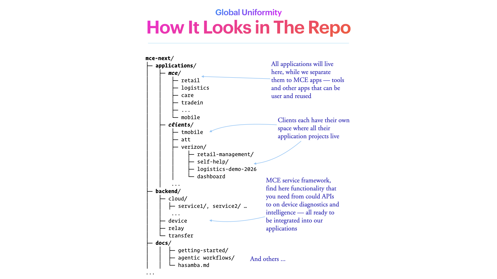

At the monorepo level, the structure mirrors the same principles:

```
mce-next/
├── applications/          # All apps live here
│   └── mce/
│       ├── retail/
│       ├── logistics/
│       ├── care/
│       └── ...
├── clients/               # Client-specific projects
│   ├── tmobile/
│   ├── att/
│   └── verizon/
│       ├── retail-management/
│       ├── self-help/
│       └── dashboard/
├── backend/               # Service framework
│   ├── cloud/
│   ├── device/
│   └── relay/
└── docs/                  # You are here
    ├── getting-started/
    └── agentic-workflows/
```

Every application inside follows the same `src/` structure. Every store branch follows the same file layout. Every component folder has the same shape. **Uniformity scales.**

---

## Part XIV: Common Anti-Patterns

Knowing what *not* to do is as important as knowing what to do. Here are the patterns that break the architecture.

### Logic in Components

```typescript
// ❌ The component is doing the listener's job
function Cart() {
  const handleCheckout = async () => {
    const isValid = validateCart(items);
    if (!isValid) return;
    const order = await api.createOrder(items);
    await api.processPayment(order.id);
    router.push("/confirmation");
  };
}

// ✅ Component dispatches, listener handles
function Cart() {
  const handleCheckout = () => {
    dispatch(initiateCheckout());
  };
}
```

### Logic in Reducers

```typescript
// ❌ The reducer is making decisions
.addCase(addToCart, (state, action) => {
  const existing = state.items.find(i => i.id === action.payload.id);
  if (existing) {
    existing.quantity += 1;
  } else {
    state.items.push({ ...action.payload, quantity: 1 });
  }
})

// ✅ Listener decides, reducer just assigns
.addCase(incrementQuantity, (state, action) => {
  state.byId[action.payload.id].quantity += 1;
})
.addCase(addNewItem, (state, action) => {
  state.items.push(action.payload.id);
  state.byId[action.payload.id] = action.payload;
})
```

### useState for Application Data

```typescript
// ❌ Application state managed locally
const [cartItems, setCartItems] = useState([]);

useEffect(() => {
  fetchCartItems().then(setCartItems);
}, []);

// ✅ Global state, listener handles the fetch
const cartItems = useAppSelector(state => state.cart.items);

useEffect(() => {
  dispatch(fetchCart());
}, []);
```

### API Calls from Components

```typescript
// ❌ Component talks directly to the API
useEffect(() => {
  fetch("/api/data").then(res => setData(res));
}, []);

// ✅ Component dispatches, listener handles the API call
useEffect(() => {
  dispatch(fetchData());
}, []);
```

### Raw HTML in JSX Return

```typescript
// ❌ Implementation details exposed
return (
  <div className="wrapper">
    <div className="header">
      <h1>{title}</h1>
    </div>
  </div>
);

// ✅ Semantic styled components
return (
  <PageWrapper>
    <PageHeader>
      <PageTitle>{title}</PageTitle>
    </PageHeader>
  </PageWrapper>
);
```

---

## Part XV: TypeScript & Code Style Essentials

The Ripe Method has strong opinions about how code should be written. Here are the essentials.

### Never Use `any`

```typescript
// ✅ unknown requires type narrowing — safe
const parseResponse = (data: unknown): User => {
  if (isUser(data)) return data;
  throw new Error("Invalid user data");
};

// ❌ any bypasses all safety
const parseResponse = (data: any): User => data;
```

### Derive Types from Source

```typescript
// ✅ Derived — stays in sync automatically
interface UserCardProps {
  userId: User["id"];
  userName: User["name"];
}

// ❌ Duplicated — will drift
interface UserCardProps {
  userId: string;
  userName: string;
}
```

### Enforce Immutability

```typescript
// ✅ Readonly state interfaces
type UserState = Readonly<{
  id: string;
  email: string;
  preferences: UserPreferences;
}>;
```

### Declarative Over Imperative

```typescript
// ✅ Declarative: what we want
const activeUsers = users.filter(user => user.isActive);

// ❌ Imperative: how to get it
const activeUsers = [];
for (let i = 0; i < users.length; i++) {
  if (users[i].isActive) activeUsers.push(users[i]);
}
```

### Function Arguments: One Object

```typescript
// ✅ Self-documenting, order-independent
const fetchUsers = async ({ page, limit, filter }: FetchUsersParams) => { ... };
await fetchUsers({ page: 1, limit: 20, filter: "active" });

// ❌ Positional — easy to mix up
const fetchUsers = async (page: number, limit: number, filter?: string) => { ... };
await fetchUsers(1, 20, undefined);
```

### Implicit Returns

```typescript
// ✅ Concise
const double = (n: number) => n * 2;
const getUserName = (user: User) => user.profile.name;

// ❌ Unnecessary ceremony
const double = (n: number) => {
  return n * 2;
};
```

### Function Declarations for Components

```typescript
// ✅ Function declaration — clear, hoistable
function UserProfile({ user, onEdit }: UserProfileProps) {
  return (
    <ProfileWrapper>
      <UserName>{user.name}</UserName>
      {onEdit && <EditButton onClick={onEdit}>Edit</EditButton>}
    </ProfileWrapper>
  );
}

// ❌ React.FC — deprecated pattern, adds implicit children
const UserProfile: React.FC<UserProfileProps> = ({ user }) => { ... };
```

---

## The Cheat Sheet

If you remember nothing else, remember this:

| Principle | One-liner |
|-----------|-----------|
| **One Global State** | All app data in a single store. No `useState` for business data. |
| **Unidirectional Flow** | Action → Reducer → State → View. Always. |
| **Fixed File Structure** | Same folders, every project. `components/`, `store/`, `modules/`, `routes/`. |
| **Three Layers** | Store (dumb), Logic (smart), View (dumb). |
| **Simple Reducers** | Assignment only. No logic. Payloads pre-formatted. |
| **Listeners for Logic** | All side effects, API calls, and decisions happen in listeners. |
| **Actions as Vocabulary** | `verbFeatureVariant`. Actions are the feature spec. |
| **~100 Lines Per File** | If it's longer, split it. |
| **Semantic Names** | `<QueueTools>` not `<div>`. `fetchUserProfile` not `getData`. |
| **Types Next to Usage** | `types.ts` lives adjacent to the code that uses it. |
| **Return ASAP** | Component JSX return should come as early as possible. |
| **No Raw HTML in JSX** | Only semantic Styled Components in the return statement. |

---

## Quick Checks Before Committing

Before you push, run through this list:

- [ ] Is app state in the global store (not `useState`)?
- [ ] Do reducers only do simple assignment?
- [ ] Is business logic in listeners (not components)?
- [ ] Are files ~100 lines or less?
- [ ] Do names follow conventions?
- [ ] Is the component return statement near the top?
- [ ] Are types defined in a `types.ts` adjacent to usage?
- [ ] Does the JSX use semantic Styled Components (no raw HTML)?
- [ ] Are payloads pre-formatted to match the state shape?

---

*The Ripe Method is a living architecture. It evolves as we learn. If something doesn't make sense — remember slide 2 — ask "why?"*

*And if the answer isn't good enough, make it better.*
